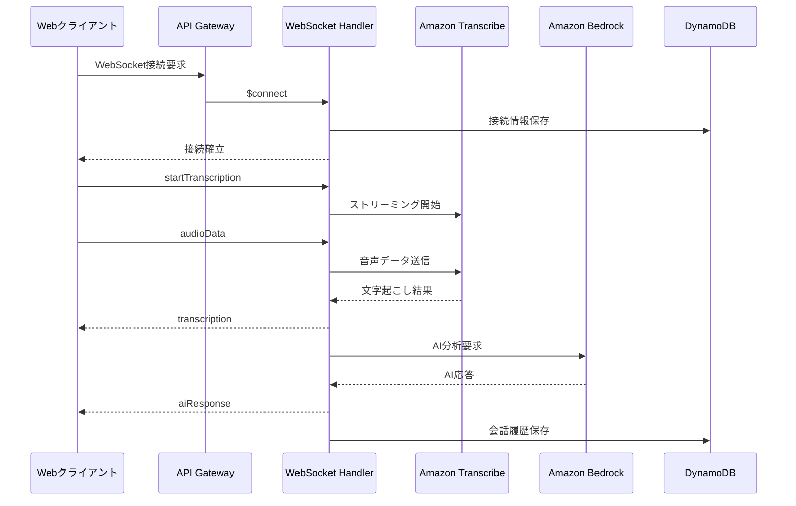

# API仕様書

## WebSocket API

### エンドポイント

**環境変数から取得**:
```bash
# 環境変数から取得
${WEBSOCKET_ENDPOINT}
```

**CDK出力から取得**:
```bash
aws cloudformation describe-stacks \
  --stack-name VtsInfrastructureStack \
  --query "Stacks[0].Outputs[?OutputKey=='WebSocketApiUrl'].OutputValue" \
  --output text
```

**デプロイ後の出力から取得**:
```bash
# デプロイ時に outputs.json に保存される
cat infrastructure/outputs.json | jq -r '.VtsInfrastructureStack.WebSocketApiUrl'
```

**例**:
```
wss://[API_ID].execute-api.ap-northeast-1.amazonaws.com/prod
```

### 接続フロー



## メッセージフォーマット

### 1. クライアント → サーバー

#### ping（接続確認）
```json
{
  "action": "ping",
  "payload": {},
  "timestamp": "2025-08-14T00:00:00Z"
}
```

**説明**: WebSocket接続の生存確認を行います。30秒間隔での送信を推奨。

#### startTranscription（文字起こし開始）
```json
{
  "action": "startTranscription",
  "payload": {
    "languageCode": "ja-JP",
    "vocabularyName": "maritime-vts-vocabulary-ja",
    "sampleRateHertz": 16000,
    "encodingFormat": "pcm"
  },
  "timestamp": "2025-08-14T00:00:00Z"
}
```

**説明**: Amazon Transcribe Streamingセッションを開始します。

**パラメータ**:
- `languageCode`: 音声認識の言語コード（必須）
- `vocabularyName`: カスタム語彙名（オプション）
- `sampleRateHertz`: サンプリングレート（デフォルト: 16000）
- `encodingFormat`: エンコード形式（デフォルト: pcm）

#### audioData（音声データ送信）
```json
{
  "action": "audioData",
  "payload": {
    "audio": "base64_encoded_audio_data",
    "sequenceNumber": 1,
    "isLastChunk": false
  },
  "timestamp": "2025-08-14T00:00:00Z"
}
```

**説明**: リアルタイム音声データをBase64エンコードして送信します。

**パラメータ**:
- `audio`: Base64エンコードされた音声データ（必須）
- `sequenceNumber`: シーケンス番号（オプション）
- `isLastChunk`: 最終チャンクフラグ（オプション）

#### stopTranscription（文字起こし停止）
```json
{
  "action": "stopTranscription",
  "payload": {
    "sessionId": "session_id"
  },
  "timestamp": "2025-08-14T00:00:00Z"
}
```

**説明**: 文字起こしセッションを停止し、リソースを解放します。

#### message（テキストメッセージ送信）
```json
{
  "action": "message",
  "payload": {
    "text": "博多港VTS、こちらさくら丸、入港許可要請",
    "messageType": "vessel_communication"
  },
  "timestamp": "2025-08-14T00:00:00Z"
}
```

**説明**: テキストメッセージを直接送信し、AI分析を実行します。

### 2. サーバー → クライアント

#### pong（接続確認応答）
```json
{
  "type": "pong",
  "timestamp": "2025-08-14T00:00:00Z"
}
```

**説明**: pingメッセージへの応答。接続が正常であることを示します。

#### status（ステータス通知）
```json
{
  "type": "status",
  "data": {
    "message": "Transcription started",
    "sessionId": "session_12345",
    "status": "ACTIVE"
  },
  "timestamp": "2025-08-14T00:00:00Z"
}
```

**説明**: システムステータスの変更を通知します。

#### transcription（文字起こし結果）
```json
{
  "type": "transcription",
  "data": {
    "transcriptText": "博多港VTS、こちらさくら丸、入港許可を要請します",
    "confidence": 0.95,
    "isPartial": false,
    "timestamp": "2025-08-14T00:00:00Z",
    "speaker": "vessel",
    "alternatives": [
      {
        "transcript": "博多港BTS、こちらさくら丸、入港許可を要請します",
        "confidence": 0.12
      }
    ]
  }
}
```

**説明**: Amazon Transcribeによる音声認識結果。

**フィールド説明**:
- `transcriptText`: 認識されたテキスト
- `confidence`: 信頼度スコア（0.0-1.0）
- `isPartial`: 部分的な結果かどうか
- `speaker`: 話者識別（vessel/vts）
- `alternatives`: 代替候補（信頼度順）

#### aiResponse（AI応答）
```json
{
  "type": "aiResponse",
  "data": {
    "classification": "GREEN",
    "suggestedResponse": "さくら丸、入港を許可します。第3バースに着岸してください。",
    "confidence": 0.92,
    "riskFactors": [],
    "recommendedActions": [
      "バース確認",
      "着岸準備指示"
    ],
    "analysisDetails": {
      "vesselName": "さくら丸",
      "requestType": "入港許可要請",
      "port": "博多港",
      "urgencyLevel": "通常"
    },
    "timestamp": "2025-08-14T00:00:00Z"
  }
}
```

**説明**: Claude Sonnet 4による通信内容の分析結果と推奨応答。

**分類基準**:
- `GREEN`: 通常の運航通信（入出港、位置報告など）
- `AMBER`: 注意が必要な状況（強風、視界不良、軽微な故障）
- `RED`: 緊急事態（メーデー、衝突、火災、重大な故障）

#### error（エラー）
```json
{
  "type": "error",
  "data": {
    "code": "TRANSCRIBE_ERROR",
    "message": "音声認識サービスでエラーが発生しました",
    "details": "Invalid audio format: expected PCM 16kHz",
    "retryable": true,
    "timestamp": "2025-08-14T00:00:00Z"
  }
}
```

**説明**: システムエラーの通知。

## エラーコード

| コード | 説明 | 対処法 | 再試行可能 |
|--------|------|--------|------------|
| `CONNECTION_ERROR` | WebSocket接続エラー | 再接続を試行 | ✅ |
| `AUTH_ERROR` | 認証エラー | 認証情報を確認 | ❌ |
| `TRANSCRIBE_ERROR` | 音声認識エラー | 音声形式・品質を確認 | ✅ |
| `BEDROCK_ERROR` | AI処理エラー | 数秒待機後に再試行 | ✅ |
| `RATE_LIMIT_EXCEEDED` | レート制限超過 | 送信頻度を下げる | ✅ |
| `INVALID_MESSAGE` | 不正なメッセージ形式 | メッセージ形式を確認 | ❌ |
| `SESSION_EXPIRED` | セッション期限切れ | 再接続が必要 | ❌ |
| `INTERNAL_ERROR` | 内部サーバーエラー | システム管理者に連絡 | ✅ |

## レート制限

| リソース | 制限値 | 期間 |
|----------|--------|------|
| WebSocket接続 | 100接続 | 1分間 |
| メッセージ送信 | 1000メッセージ | 1分間 |
| 音声データ | 100MB | 1分間 |
| AI分析要求 | 500回 | 1分間 |

## WebSocket接続管理

### 接続維持
- **Pingインターバル**: 30秒
- **タイムアウト**: 10分（無活動時）
- **自動再接続**: 3秒間隔で5回まで試行

### 再接続ロジック
```javascript
const reconnectIntervals = [1000, 3000, 5000, 10000, 30000]; // ミリ秒
let reconnectAttempts = 0;

function reconnect() {
  if (reconnectAttempts < reconnectIntervals.length) {
    const delay = reconnectIntervals[reconnectAttempts];
    setTimeout(connect, delay);
    reconnectAttempts++;
  }
}
```

## 音声データ仕様

### 推奨設定
- **サンプリングレート**: 16,000 Hz
- **ビット深度**: 16 bit
- **チャンネル**: モノラル（1チャンネル）
- **エンコーディング**: PCM (Linear PCM)
- **チャンクサイズ**: 1024バイト（約64ms相当）

### サポート形式
- PCM (推奨)
- μ-law
- A-law

### 音声品質要件
- **信号対雑音比**: 20dB以上
- **周波数帯域**: 300Hz - 3400Hz（人間の声の範囲）
- **最大遅延**: 200ms以下

## セキュリティ

### 認証
- **現在**: API Keyベース認証
- **将来**: AWS Cognitoユーザープールとの統合

### データ保護
- **転送時暗号化**: WSS (WebSocket Secure)
- **保管時暗号化**: DynamoDB/S3でのAES-256暗号化
- **データ保持**: 30日間（自動削除）

### アクセス制御
- **CORS**: 指定されたオリジンのみ許可
- **IPホワイトリスト**: 設定可能（オプション）

## 監視・ロギング

### メトリクス
- 接続数（同時/累計）
- メッセージ処理時間
- 音声認識精度
- AI応答時間
- エラー率

### ログレベル
- **ERROR**: システムエラー
- **WARN**: 警告レベルの問題
- **INFO**: 一般的な情報
- **DEBUG**: デバッグ情報（開発環境のみ）

## 使用例

### JavaScript クライアント実装例
```javascript
class VTSWebSocketClient {
  constructor(endpoint) {
    this.ws = new WebSocket(endpoint);
    this.setupEventHandlers();
  }
  
  setupEventHandlers() {
    this.ws.onopen = () => {
      console.log('Connected to VTS');
      this.startHeartbeat();
    };
    
    this.ws.onmessage = (event) => {
      const message = JSON.parse(event.data);
      this.handleMessage(message);
    };
    
    this.ws.onclose = () => {
      console.log('Disconnected from VTS');
      this.reconnect();
    };
  }
  
  startTranscription() {
    this.send({
      action: 'startTranscription',
      payload: {
        languageCode: 'ja-JP',
        vocabularyName: 'maritime-vts-vocabulary-ja'
      },
      timestamp: new Date().toISOString()
    });
  }
  
  sendAudioData(audioBuffer) {
    const base64Audio = btoa(String.fromCharCode(...audioBuffer));
    this.send({
      action: 'audioData',
      payload: { audio: base64Audio },
      timestamp: new Date().toISOString()
    });
  }
  
  send(message) {
    if (this.ws.readyState === WebSocket.OPEN) {
      this.ws.send(JSON.stringify(message));
    }
  }
  
  handleMessage(message) {
    switch (message.type) {
      case 'transcription':
        this.onTranscription(message.data);
        break;
      case 'aiResponse':
        this.onAIResponse(message.data);
        break;
      case 'error':
        this.onError(message.data);
        break;
    }
  }
}
```

## バージョン履歴

| バージョン | 日付 | 変更内容 |
|------------|------|----------|
| 1.0.0 | 2025-08-13 | 初版リリース |
| 1.1.0 | 2025-08-14 | Claude Sonnet 4対応 |

---

**最終更新**: 2025-08-14  
**バージョン**: 1.1.0  
**メンテナー**: 開発チーム