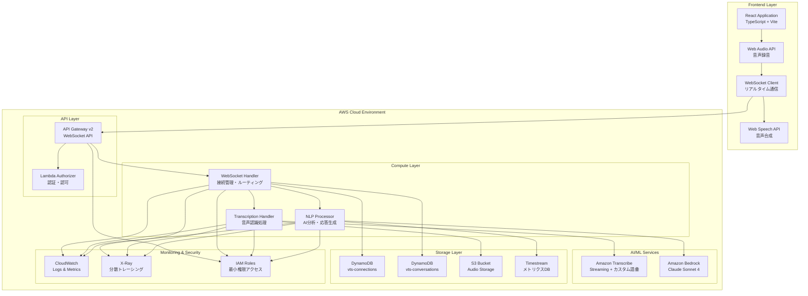
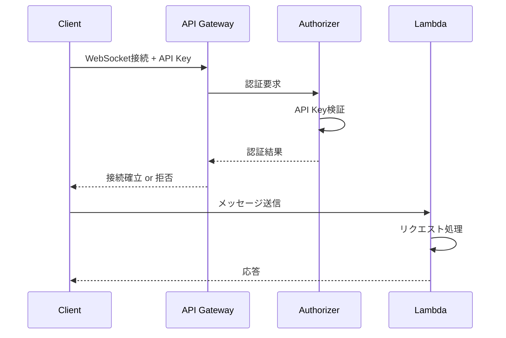
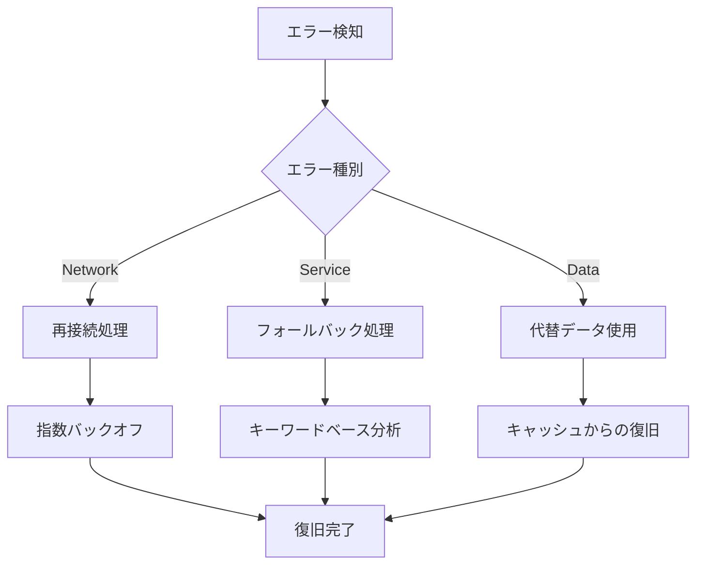

# アーキテクチャ設計書

## システム概要

福岡港湾VTS AI支援システムは、AWSのサーバーレスアーキテクチャを採用した、スケーラブルでコスト効率の高いシステムです。リアルタイム音声認識、AI分析、および応答生成を通じて、海上交通管制官の業務を支援します。

## システム全体図



## 技術スタック

### フロントエンド
| 技術 | バージョン | 用途 |
|------|------------|------|
| React | 18+ | UIフレームワーク |
| TypeScript | 5+ | 型安全性 |
| Vite | 5+ | ビルドツール |
| Tailwind CSS | 3+ | スタイリング |
| Web Audio API | - | 音声録音 |
| Web Speech API | - | 音声合成 |
| WebSocket API | - | リアルタイム通信 |

### バックエンド
| 技術 | バージョン | 用途 |
|------|------------|------|
| AWS Lambda | - | サーバーレスコンピュート |
| Node.js | 18.x | ランタイム |
| API Gateway v2 | - | WebSocket API |
| Amazon Transcribe | - | 音声認識 |
| Amazon Bedrock | - | AI/NLP |
| DynamoDB | - | NoSQLデータベース |
| S3 | - | オブジェクトストレージ |

### インフラ
| 技術 | バージョン | 用途 |
|------|------------|------|
| AWS CDK | 2+ | Infrastructure as Code |
| CloudFormation | - | リソース管理 |
| CloudWatch | - | モニタリング |
| X-Ray | - | トレーシング |
| IAM | - | アクセス制御 |

## レイヤー別詳細設計

### 1. プレゼンテーション層（Frontend）

#### React Application
```typescript
// アーキテクチャパターン
src/
├── components/          # Presentational Components
│   ├── common/         # 共通コンポーネント
│   ├── transcription/  # 文字起こし関連
│   └── response/       # AI応答関連
├── hooks/              # カスタムフック
│   ├── useWebSocket.ts # WebSocket接続管理
│   ├── useAudioRecording.ts # 音声録音
│   └── useSpeechSynthesis.ts # 音声合成
├── services/           # ビジネスロジック
│   ├── websocketService.ts
│   ├── audioService.ts
│   └── apiService.ts
├── stores/             # 状態管理
│   ├── transcriptionStore.ts
│   └── responseStore.ts
└── types/              # TypeScript型定義
    ├── websocket.ts
    └── api.ts
```

#### 音声処理
```javascript
// 音声録音設定
const audioConstraints = {
  audio: {
    sampleRate: 16000,        // Amazon Transcribe推奨
    channelCount: 1,          // モノラル
    echoCancellation: true,   // エコーキャンセリング
    noiseSuppression: true,   # ノイズ抑制
    autoGainControl: true     // 自動ゲイン調整
  }
};

// チャンク分割設定
const chunkSize = 1024;  // 1KBずつ送信（約64ms相当）
const sendInterval = 100; // 100ms間隔
```

### 2. API層

#### API Gateway WebSocket
```yaml
# WebSocket API設定
API Gateway v2:
  Protocol: WebSocket
  Routes:
    - $connect: 接続確立時
    - $disconnect: 接続終了時  
    - $default: メッセージルーティング
  
  Throttling:
    BurstLimit: 5000
    RateLimit: 2000
  
  Authorization:
    Type: LAMBDA  # カスタム認可関数
    
  CORS:
    AllowOrigins: ["https://yourapp.com"]
    AllowMethods: ["*"]
```

### 3. コンピュート層

#### Lambda関数設計

##### WebSocket Handler
```typescript
interface LambdaFunction {
  runtime: "nodejs18.x";
  memorySize: 512; // MB
  timeout: 30;     // seconds
  architecture: "arm64";
  
  environment: {
    WEBSOCKET_ENDPOINT: string;
    CONNECTIONS_TABLE: string;
    CONVERSATIONS_TABLE: string;
    LOG_LEVEL: "INFO";
  };
  
  permissions: [
    "dynamodb:PutItem",
    "dynamodb:GetItem", 
    "dynamodb:DeleteItem",
    "execute-api:ManageConnections"
  ];
}
```

##### Transcription Processor
```typescript
interface TranscriptionFunction {
  runtime: "nodejs18.x";
  memorySize: 1024; // 音声処理のため高メモリ
  timeout: 300;     // 最大5分（長時間音声対応）
  
  environment: {
    TRANSCRIBE_LANGUAGE: "ja-JP";
    VOCABULARY_NAME: "maritime-vts-vocabulary-ja";
    AUDIO_BUCKET: string;
  };
  
  permissions: [
    "transcribe:StartStreamTranscription",
    "s3:PutObject",
    "s3:GetObject"
  ];
}
```

##### NLP Processor  
```typescript
interface NLPFunction {
  runtime: "nodejs18.x";
  memorySize: 512;
  timeout: 30;
  
  environment: {
    BEDROCK_MODEL_ID: "anthropic.claude-sonnet-4-20250514-v1:0";
    MODEL_REGION: "us-east-1"; // Bedrockリージョン
    TEMPERATURE: "0.3";        // 安全性重視の低温度
  };
  
  permissions: [
    "bedrock:InvokeModel",
    "dynamodb:PutItem"
  ];
}
```

### 4. データ層

#### DynamoDB テーブル設計

##### vts-connections テーブル
```json
{
  "TableName": "vts-connections",
  "BillingMode": "PAY_PER_REQUEST",
  "AttributeDefinitions": [
    {
      "AttributeName": "connectionId",
      "AttributeType": "S"
    }
  ],
  "KeySchema": [
    {
      "AttributeName": "connectionId", 
      "KeyType": "HASH"
    }
  ],
  "TimeToLiveSpecification": {
    "AttributeName": "ttl",
    "Enabled": true
  },
  "StreamSpecification": {
    "StreamViewType": "NEW_AND_OLD_IMAGES"
  }
}
```

**データモデル例**:
```json
{
  "connectionId": "L0SM9cOFvHcCJbg=",
  "userId": "operator001", 
  "connectedAt": "2025-08-14T10:30:00Z",
  "lastActivity": "2025-08-14T10:35:00Z",
  "status": "ACTIVE",
  "clientInfo": {
    "userAgent": "Mozilla/5.0...",
    "ipAddress": "10.0.1.100"
  },
  "ttl": 1692014200  // 10分後に自動削除
}
```

##### vts-conversations テーブル
```json
{
  "TableName": "vts-conversations",
  "BillingMode": "PAY_PER_REQUEST", 
  "AttributeDefinitions": [
    {
      "AttributeName": "conversationId",
      "AttributeType": "S"
    },
    {
      "AttributeName": "timestamp",
      "AttributeType": "S" 
    }
  ],
  "KeySchema": [
    {
      "AttributeName": "conversationId",
      "KeyType": "HASH"
    },
    {
      "AttributeName": "timestamp", 
      "KeyType": "RANGE"
    }
  ],
  "GlobalSecondaryIndexes": [
    {
      "IndexName": "TimestampIndex",
      "KeySchema": [
        {
          "AttributeName": "timestamp",
          "KeyType": "HASH"
        }
      ],
      "Projection": {
        "ProjectionType": "ALL"
      }
    }
  ]
}
```

**データモデル例**:
```json
{
  "conversationId": "conv_20250814_001",
  "timestamp": "2025-08-14T10:30:15.123Z",
  "connectionId": "L0SM9cOFvHcCJbg=",
  "messageType": "VESSEL_COMMUNICATION",
  "transcription": {
    "originalText": "博多港VTS、こちらさくら丸、入港許可要請",
    "confidence": 0.95,
    "languageCode": "ja-JP",
    "processingTime": 1.2
  },
  "aiAnalysis": {
    "classification": "GREEN",
    "confidence": 0.92,
    "riskFactors": [],
    "suggestedResponse": "さくら丸、入港を許可します。第3バースに着岸してください。",
    "processingTime": 0.8
  },
  "metadata": {
    "vesselName": "さくら丸",
    "requestType": "入港許可要請",
    "port": "博多港"
  },
  "ttl": 1694592600  // 30日後に自動削除
}
```

#### S3 バケット設計
```yaml
Bucket: vts-audio-storage-{account-id}-{region}

Configuration:
  Versioning: Enabled
  Encryption: AES256
  PublicAccess: Blocked
  
  LifecyclePolicy:
    - Id: ArchiveOldAudio
      Status: Enabled
      Filter: 
        Prefix: audio/
      Transitions:
        - Days: 30
          StorageClass: GLACIER
        - Days: 90  
          StorageClass: DEEP_ARCHIVE
      Expiration:
        Days: 365  # 1年後に完全削除

  CORS:
    - AllowedOrigins: ["https://yourapp.com"]
      AllowedMethods: [GET, PUT, POST]
      AllowedHeaders: ["*"]
```

### 5. AI/ML サービス層

#### Amazon Transcribe 設定
```json
{
  "TranscriptionJob": {
    "LanguageCode": "ja-JP",
    "MediaFormat": "pcm", 
    "MediaSampleRateHertz": 16000,
    "Settings": {
      "VocabularyName": "maritime-vts-vocabulary-ja",
      "ShowSpeakerLabels": true,
      "MaxSpeakerLabels": 2,
      "ChannelIdentification": false,
      "ShowAlternatives": true,
      "MaxAlternatives": 3
    }
  }
}
```

#### カスタム語彙
```json
{
  "VocabularyName": "maritime-vts-vocabulary-ja",
  "LanguageCode": "ja-JP", 
  "Phrases": [
    "博多港", "北九州港", "門司港",
    "中央ふ頭", "箱崎ふ頭", "香椎パークポート",
    "アイランドシティ", "関門海峡",
    "さくら丸", "第三海洋丸", "コンテナ船",
    "入港許可", "出港許可", "バース",
    "メーデー", "パンパン", "セキュリテ"
  ]
}
```

#### Amazon Bedrock (Claude Sonnet 4)
```json
{
  "modelId": "anthropic.claude-sonnet-4-20250514-v1:0",
  "contentType": "application/json",
  "accept": "application/json",
  "body": {
    "anthropic_version": "bedrock-2023-05-31",
    "max_tokens": 300,
    "temperature": 0.3,
    "top_p": 0.9,
    "messages": [
      {
        "role": "system", 
        "content": "VTS管制官支援システムのプロンプト"
      },
      {
        "role": "user",
        "content": "分析対象の通信内容"
      }
    ]
  }
}
```

## セキュリティアーキテクチャ

### 認証・認可


### IAM ロール設計
```yaml
# WebSocket Handler Role
WebSocketHandlerRole:
  AssumeRolePolicyDocument:
    Version: '2012-10-17'
    Statement:
      - Effect: Allow
        Principal:
          Service: lambda.amazonaws.com
        Action: sts:AssumeRole
  Policies:
    - PolicyName: WebSocketHandlerPolicy
      PolicyDocument:
        Version: '2012-10-17'
        Statement:
          - Effect: Allow
            Action:
              - dynamodb:PutItem
              - dynamodb:GetItem 
              - dynamodb:DeleteItem
              - execute-api:ManageConnections
            Resource: !Sub "arn:aws:dynamodb:${AWS::Region}:${AWS::AccountId}:table/vts-*"

# Transcription Handler Role  
TranscriptionHandlerRole:
  Policies:
    - PolicyName: TranscriptionPolicy
      PolicyDocument:
        Statement:
          - Effect: Allow
            Action:
              - transcribe:StartStreamTranscription
              - s3:PutObject
              - s3:GetObject
            Resource: 
              - !Sub "arn:aws:s3:::vts-audio-storage-*/*"
```

## 可用性・信頼性設計

### 冗長化
- **Multi-AZ**: DynamoDB、S3は自動的にMulti-AZ
- **Lambda**: サーバーレスによる自動スケーリング
- **API Gateway**: AWSマネージドサービスの高可用性

### 障害対応


### 監視・アラート
```yaml
CloudWatch Alarms:
  - MetricName: LambdaErrors
    Threshold: 1
    ComparisonOperator: GreaterThanOrEqualToThreshold
    AlarmActions:
      - SNSTopic: critical-alerts
      
  - MetricName: DynamoDBThrottles  
    Threshold: 0
    ComparisonOperator: GreaterThanThreshold
    AlarmActions:
      - SNSTopic: performance-alerts
      
  - MetricName: APIGatewayLatency
    Threshold: 5000  # 5秒
    ComparisonOperator: GreaterThanThreshold
```

## パフォーマンス設計

### レスポンス時間目標
| コンポーネント | 目標時間 | 測定方法 |
|----------------|----------|----------|
| WebSocket接続確立 | < 1秒 | CloudWatch |
| 音声認識（部分結果） | < 500ms | カスタムメトリクス |
| AI分析・応答生成 | < 3秒 | X-Ray トレーシング |
| エンドツーエンド | < 5秒 | 統合監視 |

### スケーリング設定
```yaml
Lambda Functions:
  ConcurrentExecutions: 100  # 同時実行数制限
  ReservedConcurrency: 50    # 予約済み実行数

DynamoDB:
  BillingMode: PAY_PER_REQUEST  # オンデマンド
  AutoScaling: Enabled          # 将来的にProvisioned移行時

API Gateway:
  ThrottlingBurstLimit: 5000
  ThrottlingRateLimit: 2000
```

## コスト最適化

### サーバーレス採用効果
- **Lambda**: 実行時間分のみ課金（アイドル時間は無料）
- **DynamoDB**: オンデマンドモードでアクセス分のみ課金
- **API Gateway**: リクエスト数ベースの課金

### 月間想定コスト（100同時接続時）
| サービス | 想定使用量 | 月額コスト（USD） |
|----------|------------|-------------------|
| Lambda | 1M実行 | $20 |
| DynamoDB | 10M リクエスト | $12 |
| API Gateway | 100M メッセージ | $32 |
| Transcribe | 1000時間 | $240 |
| Bedrock | 100M トークン | $80 |
| S3 | 100GB | $3 |
| CloudWatch | - | $10 |
| **合計** | - | **$397** |

## 災害復旧・事業継続

### バックアップ戦略
```yaml
DynamoDB:
  PointInTimeRecovery: Enabled
  BackupPolicy:
    ScheduleExpression: "rate(1 day)"
    RetentionPeriod: 35  # 35日間保持

S3:
  CrossRegionReplication:
    DestinationBucket: vts-backup-us-west-2
    Status: Enabled
```

### 災害復旧手順
1. **検知**: CloudWatchアラームによる自動検知
2. **評価**: 影響範囲の特定（1-5分）
3. **切替**: 別リージョンへのトラフィック切替（10-15分）
4. **復旧**: 主系リージョンの復旧作業
5. **切戻**: 正常化後の切り戻し

### RTO/RPO目標
- **RTO (Recovery Time Objective)**: 1時間
- **RPO (Recovery Point Objective)**: 15分

## 運用・保守

### ログ管理
```json
{
  "LogFormat": "JSON",
  "LogLevel": "INFO",
  "LogRetention": 30,  // 日数
  "LogStructure": {
    "timestamp": "ISO8601",
    "level": "ERROR|WARN|INFO|DEBUG",
    "component": "WebSocketHandler|TranscriptionProcessor|NLPProcessor",
    "message": "string",
    "metadata": "object",
    "traceId": "string",
    "requestId": "string"
  }
}
```

### デプロイ戦略
```yaml
Deployment:
  Strategy: BlueGreen
  
  Stages:
    - Name: dev
      AutoDeploy: true
      Variables:
        LOG_LEVEL: DEBUG
        
    - Name: staging  
      RequiresApproval: false
      Variables:
        LOG_LEVEL: INFO
        
    - Name: prod
      RequiresApproval: true
      Variables:
        LOG_LEVEL: WARN
```

### 監視ダッシュボード
- **リアルタイム接続数**
- **メッセージ処理レート**
- **音声認識精度トレンド**
- **AI応答時間分布**
- **エラー率・種別**
- **コスト使用量**

## 今後の拡張計画

### Phase 2 拡張予定
- **AIS連携**: 船舶位置情報の統合
- **多言語対応**: 英語・中国語・韓国語
- **音声出力**: TTS（Text-to-Speech）機能

### Phase 3 高度化
- **予測分析**: 交通量・混雑予測
- **自動応答**: 定型的な通信の自動化
- **BI・分析**: 運用データの可視化・分析

---

**最終更新**: 2025-08-14  
**バージョン**: 1.0.0  
**レビュー**: システムアーキテクト承認済み